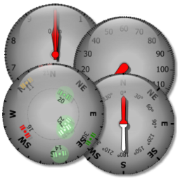
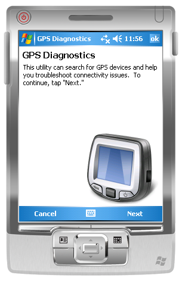
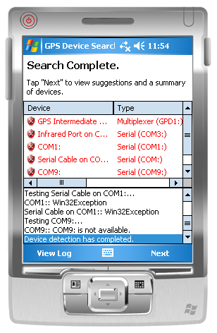
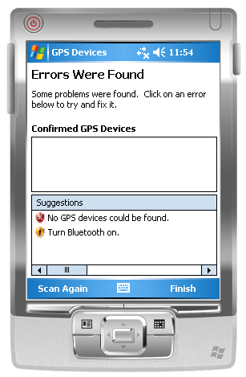
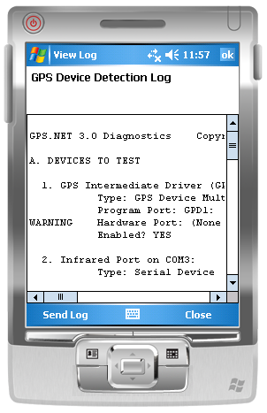

## GPS.NET 3.0 Screen Shots

## WinForms Controls
This library includes real-time **Altimeter**, **Compass**, **Speedometer**, and **SatelliteViewer** GPS controls.  This screen shot is captured from a desktop application.  The **DoubleBufferedControl** and **PolarControl** base classes are used to deliver smooth, flicker-free animations.

## GPS Diagnostics
These are screen shots of the [diagnostics utility](GPSDiagnostics.md) on a Windows Mobile 5.0 emulator.

#### Welcome Screen

#### Diagnostics Scan

#### Diagnostics Scan Results

#### Diagnostics Scan Log

